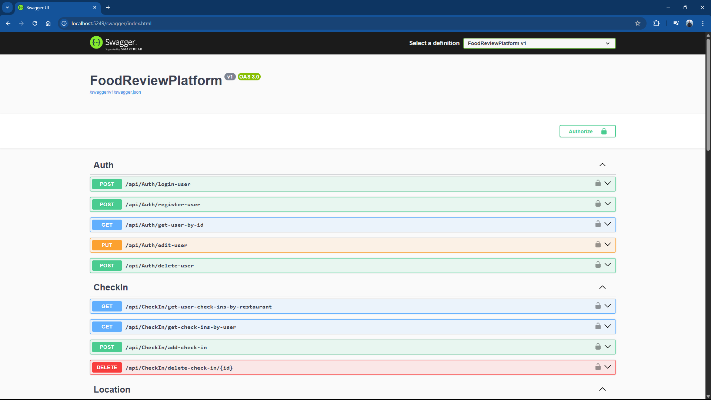

# FoodReviewPlatform

This is an **ASP.NET Web API** project that allows users to discover restaurants based on location, check in at places, write reviews.


## Getting Started

Run the project:
   ```
   dotnet run --project FoodReviewPlatform/FoodReviewPlatform.csproj
   ```

## Configuration

- Database and JWT settings are in `appsettings.Development.json`.

---

## Screenshots



